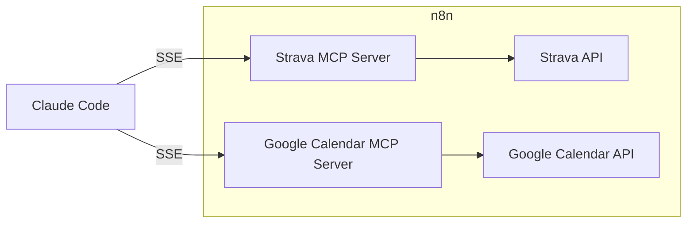

# AI Fitness Coach

A personal AI fitness coach that reviews your Strava activity and Google Calendar history to plan, adjust, and log strength and running workouts. Built with Claude Code and n8n MCP servers.

## Architecture



[n8n](https://n8n.io) is a workflow automation tool that hosts MCP servers, letting Claude Code call external APIs like Strava and Google Calendar as tools.

## Setup

### Prerequisites

1. Install [Claude Code](https://docs.anthropic.com/en/docs/claude-code): `npm install -g @anthropic-ai/claude-code`. Run `claude` to verify installation and authenticate.
2. Install [Docker Desktop](https://docs.docker.com/desktop/setup/install/mac-install). Run `docker version` to check installation. Run the Docker application — skip logging in, as it's not required.

### n8n

3. Run n8n in Docker:

    ```bash
    docker run -d \
      -p 5678:5678 \
      -v n8n_data:/home/node/.n8n \
      --name n8n \
      --restart always \
      n8nio/n8n:latest
    ```

    Go to http://localhost:5678 and sign up for an account.

4. Create the n8n MCP servers. Import [`n8n-template.json`](n8n-template.json) into your workspace, then add your own [Google Calendar credentials](https://www.youtube.com/watch?v=FBGtpWMTppw) and [Strava credentials](https://developers.strava.com) to the imported nodes.

    

<details>
<summary>5. (Optional) Test the MCP server</summary>

Initialize a connection (the URL is in **MCP Server Trigger** node > Production URL), then request the tools list:

```bash
curl -X POST http://localhost:5678/mcp/strava \
  -H "Content-Type: application/json" \
  -H "Accept: application/json, text/event-stream" \
  -D headers.txt \
  -d '{
    "jsonrpc": "2.0",
    "id": 1,
    "method": "initialize",
    "params": {
      "protocolVersion": "2024-11-05",
      "capabilities": {},
      "clientInfo": {
        "name": "curl-client",
        "version": "1.0.0"
      }
    }
  }'

SESSION_ID=$(grep -i "mcp-session-id" headers.txt | awk '{print $2}' | tr -d '\r')
echo "$SESSION_ID"

curl -N -X POST http://localhost:5678/mcp/strava \
  -H "Content-Type: application/json" \
  -H "Accept: application/json, text/event-stream" \
  -H "Mcp-Session-Id: $SESSION_ID" \
  -d '{
    "jsonrpc": "2.0",
    "id": 2,
    "method": "tools/list",
    "params": {}
  }'
```

You should see the available tools in the response. The tool names and descriptions matter — they're what the agent uses to decide which tool to call.

</details>

### Claude Code

6. Configure Claude Code to use both n8n MCP servers:

    ```bash
    claude mcp add --transport sse strava http://localhost:5678/mcp/strava
    claude mcp add --transport sse google-calendar http://localhost:5678/mcp/google-calendar
    ```

    Or add them directly to `.mcp.json` in the project root.

7. Replace [`MyWorkoutProgram.xlsx`](MyWorkoutProgram.xlsx) with your own workout program spreadsheet. This is the ground truth for your split, exercises, and volume targets.

8. Add the fitness coach skill. Copy `SKILL.md` into the Claude Code skills directory:

    ```bash
    mkdir -p .claude/skills/fitness-coach
    cp SKILL.md .claude/skills/fitness-coach/SKILL.md
    ```

    This registers the `/fitness-coach` slash command, which gives Claude the coaching instructions, programming rules, and calendar event templates.

## Usage

1. Open Docker Desktop, which automatically spins up the n8n server.
2. Run `claude` in this project directory.
3. Use the `/fitness-coach` skill — e.g. "How many miles did I run this week?" or "Plan today's workout".
